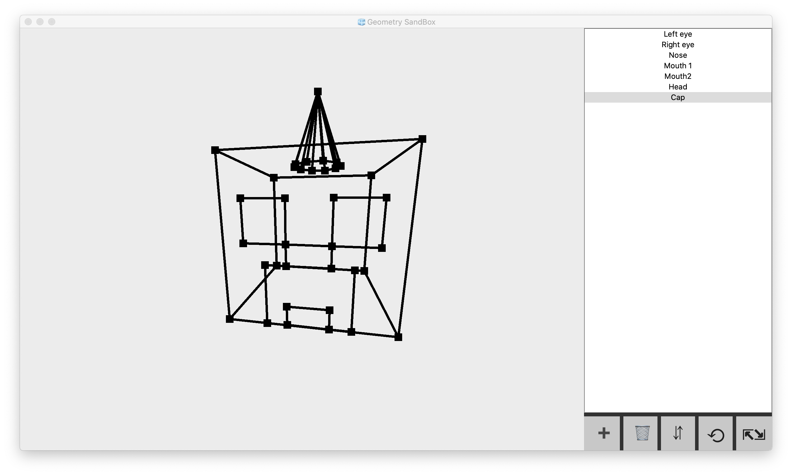

> Here's Basic 3D Editor written on Pure Python and PyQT5 for elements drawing.
You can do basic manipulations with any of this basic structures:
>  - Cube
>  - Plane
>  - Ball
>  - Cone
>  - Pyramid
>  - Tetrahedron
>  - Cylinder



## Table of contents
[General Info](#general-info)\
[Installation](#installation)\
[Launching](#launching)\
[HowToUseGuide](#howtouse-short-guide)\
[Current Status](#current-status)\
[Author](#author)

## General Info

This project was started as university project, but then was developed and improved to Standalone indie open-source project. The goal of this project is to help you quickly visualise your blueprints or imagination figures ;)

> Current stable version: 2.0-THE_BUN\
> Current beta version: 2.1.b

## Installation
Just download project and install required packages using pip:
```
pip install -r requirements.txt
```

## Launching
To execute New Sandbox just run main.py file. One of the methods is to run this Terminal command:
```
python3 main.py
```

## HowToUse short guide
  - At the bottom right you can see control buttons,
    they're your main instruments
  - Use + to Add new object
  - Use 🗑 to delete selected object
  - Use ⇵ to move selected object
  - Use ⟲ to rotate selected object
  - Use ⇱⇲ to scale selected object
  - At the right side there's objects list
  - 1 Mouse click will select the object
  - Double click will show you Renaming window
  - Tap onto 3D Canvas Zone to activate movement mechanics
  - While in Canvas use WASD + Space/Shift to move in 3D environment
  - While left mouse button pressed you can rotate camera by moving mouse

## Current Status
Project is: _no longer continue_ since I'm running out of time to develop it even further.

## Author

### Savelev Matvey
> #### Github: [@SavelevMatthew](https://github.com/SavelevMatthew)
> ##### Email: savelevmatthew@gmail.com
